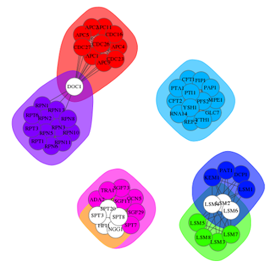
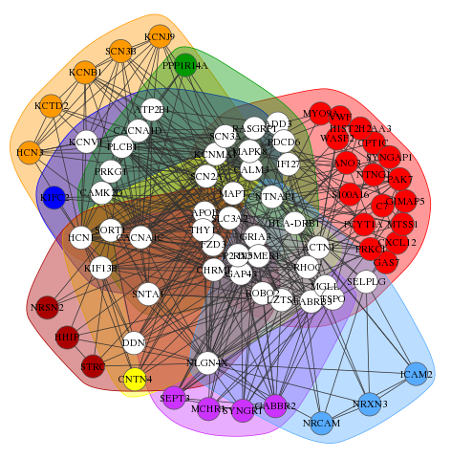
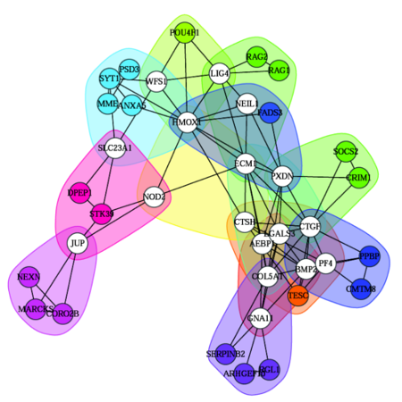
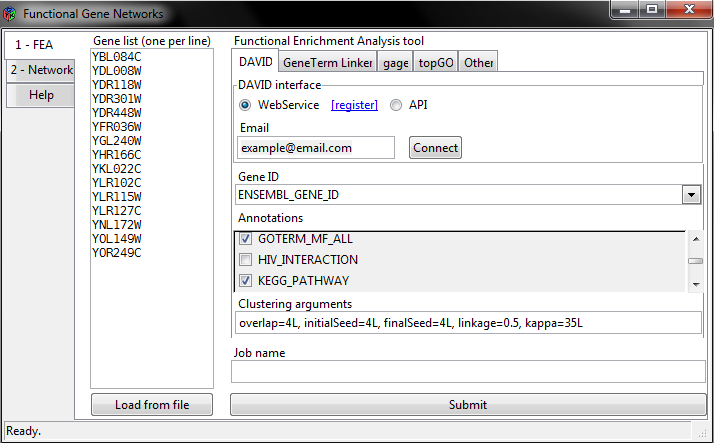
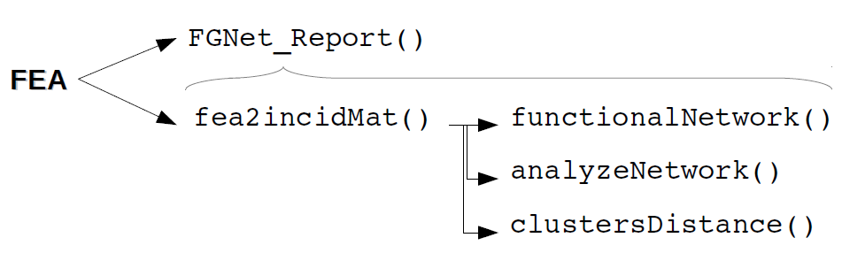
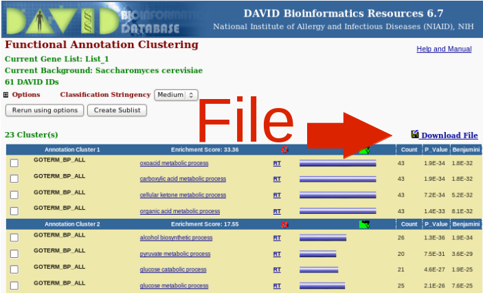
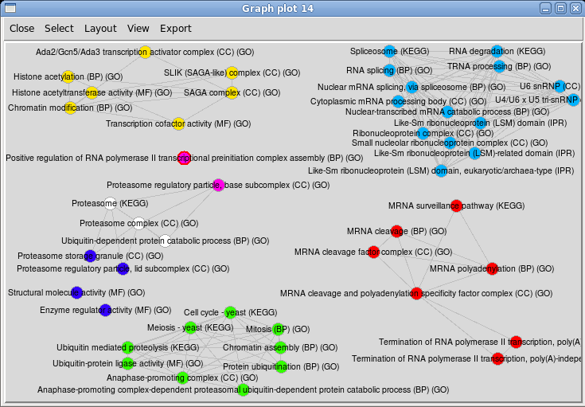
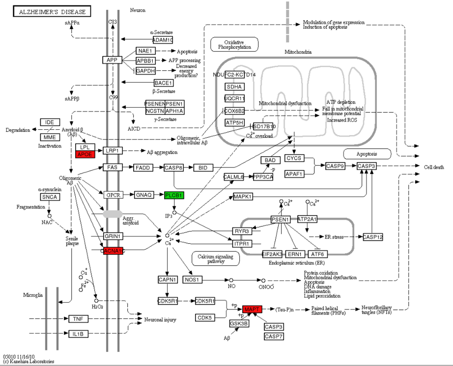

<!--
%\VignetteEngine{knitr::knitr}
%\VignetteIndexEntry{FGNet-vignette}
-->

<style type="text/css">
table{ 
    max-width: 80% !important; 
    float:center;
}
img { 
    max-width: 80% !important; 
}
table img{ 
    max-width: 300px !important; 
   }
.subtitle{
    font-size:100%;
    font-style: italic; 
}
</style>


# Introduction to FGNet

FGNet allows to perform a Functional Enrichment Analysis (FEA) on a list of genes or expression set, and transform the results into networks. The resulting functional networks provide an overview of the biological functions of the genes/terms, and allows to easily see links between genes, overlap between clusters, finding key genes... etc.


## Biological functional analysis

After obtaining a list of genes or proteins from an experiment or omic studies (microarrays, RNAseq, mass spectrometry, etc), the next step is usually to perform a functional analysis of the genes to search for the biological functions or processes in which they are involved. In order to facilitate the analysis of large lists of genes, multiple functional enrichment tools have been developed. These tools search for the genes in biological databases (i.e. GO, Kegg, Interpro), and test whether any biological annotations are over-represented in the query gene list compared to what would be expected in the whole population. However, the raw output from a functional enrichment analysis often provides dozens or hundreds of terms, and it still requires a lot of time and attention to go through the whole list of genes and annotations. A way to simplify this task is grouping genes and terms which often appear together and create associated networks: the Functional Networks.

FGNet builds the functional networks, based on a previous functional analysis. The package provides the functions to perform the FEA through these specific tools:
    
* Functional Annotation Clustering from **DAVID**, which measures relationships among annotation terms based on their co-association with genes within the query gene list ([Huang et al](#references)). This type of clustering mostly results in groups of highly related terms, such as synonymous annotations from different annotation spaces (i.e. Glycolysis in KEGG and GO-BP), which also share most of their genes.     
* **GeneTerm Linker**, a post-enrichment tool, which focuses on clearing and sorting the results from a previous enrichment analysis. This is achieved by filtering little informative terms (i.e. *cellular process*) and redundant annotations (i.e. *metabolic process* and *primary metabolic process*). The remaining gene-term sets are grouped into `metagroups` based on their shared genes and terms (*reciprocal linkage*) ([Fontanillo et al](#references)).
* **Gage** ([Alexa et al](#references)), a Gene Set Analysis (GSA) tool. It allows to search for pathways that are altered in any way (i.e. some genes UP and some DOWN), or altered consistently in the same direction (UP or DOWN). It can also cluster the resulting enriched gene-term sets.
* **TopGO** ([Luo et al](#references)), a modular enrichment analysis method for the Gene Ontology (GO) that can be applied offline.


To build the network based on other *other tools*, the raw output should be saved into a text file which contains the enriched terms and their genes. (For more details see function `format_results()`).

## Functional network 

The **functional network**  is the representation of the results from a functional enrichment analysis.

In the **default**  network, all the nodes of the network are of the same type, i.e. genes OR terms, which are linked to each other if they are in the same gene-term set. In the plot, the genes/terms in the same  groups (metagroups or clusters) are surrounded by a common background color. 

In the **bipartite**  network, the nodes are of two types, allowing to link the genes or terms, with the clusters they belong to. This network, can be built as an *intersection network* , a simplified functional network where all the genes/terms that belong to only one metagroup are clustered into a single node. This simplified network contains only the nodes in several groups. 

In addition to the networks, FGNet also provides a few functions for further analysis. These functions allow to get a **distance matrix** , which represents the similarity between the groups based on the genes they share with each other (binary distance), and the distribution of **degree and betweenness**  within the network and subnetworks, in order to find the most important genes (hubs).

All these functionalities can be accessed directly through the appopiate functions or the graphical user interface (GUI). In addition, FGNet also allows to generate an  **HTML report**  with an overview of these plots and analyses for a specific gene list.

Examples of functional network for different analyses: 

|      |      |      |
|:-----|:-----|:-----|
|            |        |        |

    
# Installation
To install *FGNet* from *Bioconductor*, type in your R console:
```{r, eval=FALSE}
source("http://bioconductor.org/biocLite.R")
biocLite("FGNet")
```
```{r, echo=FALSE, message=FALSE}
library(FGNet)
```

# Creating a network from a list of genes/proteins
To generate a functional network with FGNet:
    
1.  Perform a Functional Enrichment Analisis (FEA) on a list of genes or expression set.
    
    |FEA tool         |Online?  |Input          |Annotations        |
    |:----------------|:---------|:--------------|:------------------|
    |DAVID            |Yes       |Gene list      |Many               |
    |Gene-Term Linker |Yes       |Gene list      |GO, KEGG, Interpro |
    |TopGO            |No        |Gene list      |GO                 |
    |Gage (GSA)       |No        |Expression set |Any gene set       |


2.  Create an [HTML report](#html-report) with multiple views of the networks and analyses.
3.  Personalize or analyze an [specific network](#individual-networks). 

These steps are integrated into the Graphical User Interface (GUI), which provides access to the main functionalities of FGNet.

## Graphical User Interface (GUI)

The Graphical User Interface (GUI) provides access to most FGNet functionalities. To launch the GUI, type in the R console:

```
library(FGNet)
FGNet_GUI()
```


    
In case you already have a gene list or gene expression from a previous analysis, it is possible to load it directly into the GUI genes field by passing it as argument:

```{r, eval=FALSE}
geneExpr <- c("YBL084C", "YDL008W", "YDR118W", "YDR301W", "YDR448W", 
              "YFR036W", "YGL240W", "YHR166C", "YKL022C", "YLR102C", "YLR115W", 
              "YLR127C", "YNL172W", "YOL149W", "YOR249C")
geneExpr <- setNames(c(rep(1,10),rep(-1,5)), geneExpr)

FGNet_GUI(geneExpr)
```

## In R code...
The first step in the workflow is always is to perform a Functional Enrichment Analisis (FEA) on a list of genes or expression set. 

Once the FEA is ready, you can proceed to generate the HTML report or the individual network/analyses:


    
For help or more details on any functions or their arguments, just set a ? before its name.

```{r, eval=FALSE}
?FGNet_report
```

### Functional Enrichment Analysis (FEA)

Since the arguments required to perform the FEA deppends on the tool, there are several FEA functions:

| FEA tool  | Function | Output group type |
|----------|---------|---------|
| DAVID | `fea_david()` | Clusters |
| TopGO | `fea_topGO()` | Gene-term sets |
| Gene-Term Linker | `fea_gtLinker()` & `fea_gtLinker_getResults()` | Metagroups |
| Gage | `fea_gage()` | Clusters |
| Other | `format_feaResults()` | |

    
**DAVID**

Using DAVID requires internet connection. In addition, we recommend to register at http://david.abcc.ncifcrf.gov/webservice/register.htm to perform the queries through its Web Service.


```{r, results="hide", message=FALSE}
genesMetabolism <- c("YGR175C", "YHR007C", "YMR202W", "YJL167W", 
                     "YNL280C", "YGR060W", "YGL001C", "YLR100W", "YLR056W", "YGL012W", 
                     "YMR015C", "YML008C", "YHR072W", "YHR190W", "YKL004W", "YBR036C", 
                     "YDR294C", "YDR072C", "YKL008C", "YHL003C", "YMR296C", "YDR062W", 
                     "YJL134W", "YOR171C", "YLR260W", "YMR298W", "YMR272C", "YPL057C",
                     "YDR297W", "YBR265W", "YPL087W", "YBR183W", "YKR053C")
# To add the gene label/symbol to the plots...
library(org.Sc.sgd.db)
geneLabels <- unlist(as.list(org.Sc.sgdGENENAME)[genesMetabolism])
# To add gene expression color to the plots...
gMetabolismExpr <- setNames(rnorm(33,mean=0,sd=3), geneLabels)
```

```{r, eval=FALSE}
results_David <- fea_david(genesMetabolism, geneLabels=geneLabels, 
                           email="example@email.com")
```

**TopGO**
    
TopGO does not require internet connection since it relies on local databases. However, the results from topGO are provided as individual gene-term sets, not grouped into clusters.

An example with the previous gene list:

```{r, eval=FALSE}
results_topGO <- fea_topGO(genesMetabolism, geneIdType="ENSEMBL", 
                           geneLabels=geneLabels, organism="Sc") 
```


**Gene-Term Linker**
    
Since the analysis with Gene-Term Linker usually takes several minutes to be ready, the workflow is divided in two steps: (1) sending the analysis request, and (2) retrieving the results:

```{r}
genesYeast <- c("ADA2", "APC1", "APC11", "APC2", "APC4", "APC5", "APC9", "CDC16", 
                "CDC23", "CDC26", "CDC27", "CFT1", "CFT2", "DCP1", "DOC1", "FIP1", 
                "GCN5", "GLC7", "HFI1", "KEM1", "LSM1", "LSM2", "LSM3", "LSM4", 
                "LSM5", "LSM6", "LSM7", "LSM8", "MPE1", "NGG1", "PAP1", "PAT1", 
                "PFS2", "PTA1", "PTI1", "REF2", "RNA14", "RPN1", "RPN10", "RPN11", 
                "RPN13", "RPN2", "RPN3", "RPN5", "RPN6", "RPN8", "RPT1", "RPT3", 
                "RPT6", "SGF11", "SGF29", "SGF73", "SPT20", "SPT3", "SPT7", "SPT8", 
                "TRA1", "YSH1", "YTH1")
# Optional: Gene expression (1=UP, -1=DW)
genesYeastExpr <- setNames(c(rep(1,29), rep(-1,30)),genesYeast) 
```

```{r, eval=FALSE}
jobID <- fea_gtLinker(geneList=genesYeast,organism="Sc")
```

once the analysis is ready...

```{r}
jobID <- 3907019
results_gtLinker <- fea_gtLinker_getResults(jobID=jobID, organism="Sc")
```

**Gage**
    
As a GSA approach, instead of performing the functional enrichment over a gene list, gage requires a raw expression set and the samples to compare:

```{r, eval=FALSE}
library(gage); data(gse16873)
results_gage <- fea_gage(eset=gse16873, 
                         refSamples=grep('HN',colnames(gse16873), ignore.case =T), 
                         compSamples=grep('DCIS',colnames(gse16873), ignore.case=T), 
                         geneIdType="ENTREZID", organism="Hs", annotations="REACTOME")
FGNet_report(results_gage)
```

**Other tools**
    
To import the results from a functional enrichment analysis performed with other tools, see:

```{r, eval=FALSE}
?format_results()
```

**Web analysis**

FGNet can also be applied to an analysis performed at DAVID and GeneTerm Linker web site:

*  DAVID: http://david.abcc.ncifcrf.gov (Functional Annotation Clustering Tool)
*  GeneTerm Linker: http://gtlinker.cnb.csic.es


To import these results into FGNet, use DAVID's `download file` or GeneTerm linker's `job ID`, and the functions `format_david()` or `fea_gtLinker_getResults()`:

| David | Gene-term Linker |
|:-----|:-----|
|            |        |

```{r, eval=FALSE}
results <- format_david("http://david.abcc.ncifcrf.gov/data/download/90128.txt")
results <- fea_gtLinker_getResults(jobID=3907019)
```

### HTML report
The HTML report function allows to create a comprehensive report including diferent views of the Functional Network, the cluster/metagroup legend, and some further statistics directly directly from a gene list. 

Here is the code to use `FGNet_report()` with each of the previous examples:
```{r, eval=FALSE}
FGNet_report(results_topGO, geneExpr=gMetabolismExpr)  
FGNet_report(results_David, geneExpr=gMetabolismExpr) 
FGNet_report(results_gtLinker, geneExpr=genesYeastExpr)
FGNet_report(results_gage)
```

By default, the clusters included in these reports are filtered out to get cleaner results. The default values depend on the tool, and can be modified through FGNet_report arguments:
```{r, eval=FALSE}
data(FEA_tools)
FEA_tools[,4:6]
```

```{r, eval=FALSE}
FGNet_report(results_gtLinker, filterThreshold=0.3)
```

```{r, eval=FALSE}
?FGNet_report
```


### Individual networks
To generate specific networks rather than the full report, after the FEA is ready, use `fea2incidMat()` to generate the incidence matrices that represent the networks:

```{r}
results <- results_gtLinker
incidMat <- fea2incidMat(results)
incidMat$metagroupsMatrix[1:5, 1:5]
incidMat_terms <- fea2incidMat(results, key="Terms")
incidMat_terms$metagroupsMatrix[5:10, 1:5]
```

These incidence matrices can be plotted and anlyzed in diferent ways:

```{r Default functional network}
functionalNetwork(incidMat, geneExpr=genesYeastExpr,
    plotTitleSub="Default gene view")
```

```{r}
getTerms(results)[1]
```

```{r, eval=FALSE}
functionalNetwork(incidMat_terms, plotOutput="dynamic")
```




```{r Bipartite functional network}
functionalNetwork(incidMat_terms, plotType="bipartite",
    plotTitleSub="Terms in several metagroups")
```

#Advanced example: editing and creating new networks

In this section we will use the functional analysis of an Alzheimer dataset ([GSE4757](http://www.ncbi.nlm.nih.gov/geo/query/acc.cgi?acc=GSE4757)):
```{r}
jobID <- 1639610
feaAlzheimer <- fea_gtLinker_getResults(jobID=jobID, organism="Hs")
```

The variable `feaAlzheimer` contains the raw results from the functional analysis. The slot `metagroups` could also be `clusters` or missing depending on the FEA tool:
```{r}
names(feaAlzheimer)
```

```{r, results='hide'}
head(feaAlzheimer$metagroups)
```

To see the terms in each cluster/metagroup use `getTerms()`:
```{r}
getTerms(feaAlzheimer)[3:4]
```

## Incidence matrices

The FEA results should be transformed into incidence matrices to create the netwok. These matrices are the internal representation of the network: they contain which genes are in each metagroup or cluster and in each gene-term set. Therefore, it is in this step where the main shape of the network is determined. 

The function to create the incidence matrices is `fea2incidMat()`. It allows to filter out clusters, decide wether the networks should be gene-based or term-based, stablish the groups to link the genes/terms, etc...

We will start the example creating a simple gene-based network:

```{r}
incidMat <- fea2incidMat(feaAlzheimer)
```

```{r}
head(incidMat$metagroupsMatrix)
incidMat$gtSetsMatrix[1:5, 14:18]
```

To filter or select with metagroups to show, use the arguments `filterAttribute`, `filterOperator` and `filterThreshold`. `filterAttribute` should be a column from the `feaAlzheimer$clusters` or `feaAlzheimer$metagroups` data frames. The recommended filters for each tool can be seen in the object `FEA_tools`, which contains the default filters when generating the HTML report:

```{r, eval=FALSE}
data(FEA_tools)
FEA_tools[,4:6]
```

```{r}
incidMatFiltered <- fea2incidMat(feaAlzheimer, 
    filterAttribute="Silhouette Width", filterOperator="<", filterThreshold=0.2)
```

To see which metagroups/clusters have been filtered out and will not be shown in the networks:

```{r, eval=FALSE}
incidMatFiltered$filteredOut
```


For more on selecting and filtering groups see section '[filtering](#filtering-and-selecting-clusters)'.
To build the [networks based on terms](#terms-networks), use the argument `key="Terms"`.

## Functional network

The function `functionalNetwork()` generates and plots the networks.
In case there is available expression data, it can be used for representation in this step:

```{r}
# (Fake expression data)
geneList <- rownames(incidMat$metagroupsMatrix)
geneExpr <- setNames(c(rep(1,40), rep(-1,37)), geneList)
```

The `default` plot will plot all the genes/terms in the network, and will return the netwoks as igraph objects and matrices in an invisible list. The argument `keepColors` determine wether the colors should be consistent, taking into account the filtered groups, or restarted:
```{r}
fNw <- functionalNetwork(incidMatFiltered, geneExpr=geneExpr, 
    keepColors=FALSE)
```

By setting the parameter `plotOutput="dynamic"` instead of an static plot, it will create an interactive one. By setting  `plotOutput="none"`, it is possible to produce only the network without plotting.
```{r, eval=FALSE}
functionalNetwork(incidMatFiltered, geneExpr=geneExpr, plotOutput="dynamic") 
fNw <- functionalNetwork(incidMatFiltered, plotOutput="none") 
```

Since the returned networks are `iGraph` objects, they can be used or analyzed as such:
```{r}
names(fNw)
names(fNw$iGraph)
library(igraph)
clNw <- fNw$iGraph$commonClusters
clNw
```

```{r, eval=FALSE}
vcount(clNw)
ecount(clNw)
sort(betweenness(clNw), decreasing=TRUE)[1:10]
igraph.to.graphNEL(clNw)
```

In dynamic plots (`tkplot`) it is not possible to draw the metagroup background. However, you can save the layout of a dynamic network, and plot it as static using the argument `vLayout`:

```{r, eval=FALSE}
functionalNetwork(incidMatFiltered, plotOutput="dynamic") 
# Modify the layout...
saveLayout <- tkplot.getcoords(1)   # tkp.id (ID of the tkplot window)
functionalNetwork(incidMatFiltered, vLayout=saveLayout)
```

## Bipartite and intersection network
The default `bipartite` version of the functional network plots the *intersection network*: a simplified functional network, containing only the nodes in several metagroups and the metagroups they belong to. In this network, metagroup nodes (the coloured noces) can be seen as a cluster of all the genes/proteins that belong only to that metagroup:

```{r}
mgKeyTerm <- keywordsTerm(getTerms(feaAlzheimer), 
    nChar=100)[-c(as.numeric(incidMatFiltered$filteredOut))]
functionalNetwork(incidMatFiltered, plotType="bipartite", legendText=mgKeyTerm)
```

To plot a full bipartite network including all the nodes, just set `keepAllNodes=TRUE`:
```{r}
functionalNetwork(incidMatFiltered, geneExpr=geneExpr, plotType="bipartite",
    keepAllNodes=TRUE, plotTitleSub="Bipartite network will all nodes")
```

## Terms networks

In the same way we have built networks to explore the relationship between genes, the same approach can be used to explore the relationship between the biological terms in the enrichment analysis. i.e. to see which biological terms are usually associated, or locate which terms are in several groups. 
To do so, build the incidence matrices based on terms instead of genes using the argument `key="Terms"`.

```{r}
incidMatTerms <- fea2incidMat(feaAlzheimer, key="Terms")
```

```{r}
functionalNetwork(incidMatTerms, plotType="bipartite", 
    plotTitle="Terms in several metagroups")
```

By default, the functional network is built establishing links between nodes (genes or terms) in the same gene-term sets. Depending on the tool, this network might have few or no edges:

```{r, eval=FALSE}
functionalNetwork(incidMatTerms,  weighted=TRUE, plotOutput="dynamic")
```

To plot a network with links between all the terms in the same cluster or metagroups, use `fea2incidMat()` with the `$cluster` or `$metagroup` slots from the FEA, in order to consider the whole cluster/metagroup as a gene-term set:

```{r}
incidMatTerms <- fea2incidMat(feaAlzheimer$metagroups, clusterColumn="Metagroup", 
    key="Terms",
    filterAttribute="Silhouette.Width", filterThreshold=0.2)
functionalNetwork(incidMatTerms, legendText=FALSE, plotOutput="dynamic")
```

```{r}
functionalNetwork(incidMatTerms, legendText=FALSE)
```

Since GeneTerm Linker filters out generic and redundant terms from the final metagroups, by default these terms are not plotted. To include them in the graph, set the argument `removeFiltered=FALSE` (only available for GeneTerm Linker).

```{r, fig.height=5, fig.width=10}
incidMatTerms <- fea2incidMat(feaAlzheimer, key="Terms", removeFilteredGtl=FALSE)
par(mfrow=c(1,2))
functionalNetwork(incidMatTerms, vLabelCex=0.2,
    plotTitle="Including filtered terms", legendText=FALSE)
functionalNetwork(incidMatTerms, plotType="bipartite", vLabelCex=0.4,
    plotTitle="Including filtered terms")
```

For more information on the filtered terms see ([Fontanillo et al](#references)) or http://gtlinker.cnb.csic.es/gtset/help .

## Genes - Terms networks

To build a genes-terms network, we can use the bipartite plot with the appropiate formating of the input matrices.

For many FEA tools it will be enough with appliying the `fea2incidMat()` directly to the `$geneTermSets` matrix selecting the gene-term sets we want to plot.
i.e. gene-term sets in a specific cluster, filter generic terms (terms annotated to more than X genes), etc...

Note that this approach might not be appropiate for GeneTerm Linker, since it groups several terms into each gene-term set.

```{r}
txtFile <- paste(file.path(system.file('examples', package='FGNet')), "David_Metabolism.txt", sep=.Platform$file.sep)
feaMetabolism <- format_david(txtFile, jobName="David_Metabolism",geneLabels=geneLabels)
```

```{r, eval=FALSE}
feaMetabolism <- fea_david(genesMetabolism, email="...", geneLabels=geneLabels)
```

```{r}
gtSets <- feaMetabolism$geneTermSets
gtSets <- gtSets[gtSets$Cluster %in% c(9),] 
gtSets <- gtSets[gtSets$Pop.Hits<500,]
```

Then, create a terms-genes incidence matrix with `fea2incidMat()`, and plot the network...

```{r, message=FALSE}
termsGenes <- t(fea2incidMat(gtSets, clusterColumn="Terms")$clustersMatrix)
library(R.utils)
rownames(termsGenes) <- sapply(strsplit(rownames(termsGenes), ":"), 
    function(x) capitalize(x[length(x)]))
termsGenes[1:5,1:5]
```

Network with genes colored based on their expression and terms on alphabetical order:
```{r}
functionalNetwork(t(termsGenes), plotType="bipartite", keepAllNodes=TRUE,
    legendPrefix="", plotTitle="Genes - Terms network", plotTitleSub="",
    geneExpr=gMetabolismExpr, plotExpression="Fill")
```  

Network with genes colored by alphabetical order (from red to pink), terms white:
```{r}
functionalNetwork(termsGenes, plotType="bipartite", keepAllNodes=TRUE,
    legendPrefix="", plotTitle="Genes - Terms network", plotTitleSub="")
```

#Filtering and selecting clusters

In this section we will analyze with DAVID a list with genes from 2 metabolic pathways in yeast: *ergosterol biosynthesis* and *sphingolipid metabolism*, as an example of a network with very overlapping clusters.

```{r, eval=FALSE}
feaMetabolism <- fea_david(genesMetabolism, email="...", geneLabels=geneLabels)
incidMat <- fea2incidMat(feaMetabolism)
functionalNetwork(incidMat, legendText=FALSE) 
```

```{r}
incidMat <- fea2incidMat(feaMetabolism)
functionalNetwork(incidMat) 
```

```{r}
incidMatTerms <- fea2incidMat(feaMetabolism, key="Terms")
```

```{r, eval=FALSE}
functionalNetwork(incidMatTerms$clustersMatrix, plotOutput="dynamic",
  weighted=TRUE, eColor="grey")
```

```{r}
functionalNetwork(incidMatTerms$clustersMatrix, plotType="bipartite", 
 plotTitle="Terms in several clusters")
```


## Filtering based on a cluster *propperty*

The clusters to plot can be selected/filtered based on any propperty that is available in the clusters matrix:

```{r}
colnames(feaMetabolism$clusters)
```

i.e. Selecting the clusters with highest Enrichment Score or least genes (setting `eColor=NA`, plots the networks without edges):

```{r, fig.height=5, fig.width=10}
par(mfrow=c(1,2))

# Highest enrichment score
filterProp <- as.numeric(as.character(
    feaMetabolism$clusters$ClusterEnrichmentScore))
quantile(filterProp, c(0.10, 0.25, 0.5, 0.75, 0.9))
incidMatFiltered <- fea2incidMat(feaMetabolism, 
    filterAttribute="ClusterEnrichmentScore",
    filterOperator="<", filterThreshold=10)
functionalNetwork(incidMatFiltered, eColor=NA,
    plotTitle="Highest enrichment score")

# Lowest genes
quantile(as.numeric(as.character(feaMetabolism$clusters$nGenes)),
    c(0.10, 0.25, 0.5, 0.75, 0.9))
incidMatFiltered <- fea2incidMat(feaMetabolism, 
 filterAttribute="nGenes", filterOperator=">", filterThreshold=15)
functionalNetwork(incidMatFiltered, eColor=NA,
    plotTitle="Smaller clusters")
```
 
To use any propperty that is not available in the `$clusters` data frame, just add it as column to the dataframe.
 
## Selecting clusters with specific *terms or keywords*

```{r}
keywords <- c("sphingolipid") 
selectedClusters <- sapply(getTerms(feaMetabolism), 
    function(x) 
    any(grep(paste("(", paste(keywords, collapse="|") ,")",sep=""), tolower(x))))
```
```{r, eval=FALSE}
getTerms(feaMetabolism)[selectedClusters]
```
```{r}
tmpFea <- feaMetabolism
tmpFea$clusters <- cbind(tmpFea$clusters, keywords=selectedClusters)
incidMatSelection <- fea2incidMat(tmpFea, 
 filterAttribute="keywords", filterOperator="!=",filterThreshold="TRUE")
functionalNetwork(incidMatSelection, plotType="bipartite", plotOutput="dynamic")
```

## Selecting *specific groups*

`clustersDistance()` allows to explore the overlap between groups:
```{r}
distMat <- clustersDistance(incidMat)
```

Clusters 1, 7 and 9 seem to be very close (overlapping), let's see:
```{r}
selectedClusters <- rep(FALSE, nrow(feaMetabolism$clusters))
selectedClusters[c(1,7,9)] <- TRUE

tmpFea <- feaMetabolism
tmpFea$clusters <- cbind(tmpFea$clusters, select=selectedClusters)
incidMatSelection <- fea2incidMat(tmpFea, 
  filterAttribute="select", filterOperator="!=",filterThreshold="TRUE")
functionalNetwork(incidMatSelection, eColor=NA)
```

#Further analyses

## analyzeNetwork() 
`analyzeNetwork()` can be used to explore the structure of the network. It also returns statistics about the nodes betweeness within each cluster, etc...

The example with GeneTerm Linker (Alzheimer):
```{r}
incidMatFiltered <- fea2incidMat(feaAlzheimer, 
    filterAttribute="Silhouette Width", filterOperator="<", filterThreshold=0.2)
stats <- analyzeNetwork(incidMatFiltered)
```
```{r}
names(stats)
stats$transitivity
```

`$degree` and `$betweeness` are the values used for the plots. They contain the values for each of the nodes in the global network (commonClusters) and within each cluster/metagroup (subsets of commonGtSets network). The degree is given as percentage, normalized based on the total number of nodes of the network. i.e. a value of 90 in a network of 10 nodes, would mean the actual degree of the node is 9: it is conneded to 9 nodes (90% of 10)).

The betweeness of each node in each cluster as matrix:
```{r}
head(stats$betweenessMatrix)
```

**Inter-modular hubs:** Nodes with betweeness within the top 75% in the global network
```{r}
stats$hubsList$Global
```

**Intra-modular hubs:** Nodes with betweeness within the top 75% in each cluster sub-network
```{r}
stats$hubsList$"9"
``` 

DAVID's example: 
```{r}
incidMat_metab <- fea2incidMat(feaMetabolism)
analyzeNetwork(incidMat_metab)
```

Note the structure of the network varies not only depending on the dataset, but also on the tool. Since tools like DAVID link all the nodes/terms within each cluster, their internal normalized degree is always 100%.


## plotGoAncestors() and plotKegg()

`plotGoAncestors()` and `plotKegg()` also allow to explore the significant gene term sets:
```{r}
goIds <- getTerms(feaMetabolism, returnValue="GO")[[10]]
plotGoAncestors(goIds, ontology="MF", nCharTerm=40)
```

```{r, eval=FALSE}
genesAlz <- rownames(fea2incidMat(feaAlzheimer)$metagroupsMatrix)
genesAlzExpr <- setNames(c(rep(1,50), rep(-1,27)),genesAlz) 

keggIds <- getTerms(feaAlzheimer, returnValue="KEGG")[[3]]
plotKegg("hsa05010", geneExpr=genesAlzExpr, geneIDtype="GENENAME")
# Saved as .png in current directory
```



# Acknowledgements
This work was supported by Instituto de Salud Carlos III and by a grant from the Junta de Castilla y Leon and the European Social Fund to S.A and C.D.

# References 
* Huang DW, Sherman BT, Lempicki RA. *Systematic and integrative analysis of large gene lists using DAVID Bioinformatics Resources.* Nature Protoc. 2009;4(1):44-57.

* Huang DW, Sherman BT, Lempicki RA. *Bioinformatics enrichment tools: paths toward the comprehensive functional analysis of large gene lists.* Nucleic Acids Res. 2009;37(1):1-13.

* Fontanillo C, Nogales-Cadenas R, Pascual-Montano A, De Las Rivas J (2011) *Functional Analysis beyond Enrichment: Non-Redundant Reciprocal Linkage of Genes and Biological Terms.* PLoS ONE 6(9): e24289. doi: 10.1371/journal.pone.0024289 

* Alexa A, and Rahnenfuhrer J (2010) *topGO: Enrichment analysis for Gene Ontology.* R package version 2.16.0. URL: http://www.bioconductor.org/packages/release/bioc/html/topGO.html

* Luo W, Friedman MS, Shedden K, Hankenson KD, Woolf PJ (2009) *GAGE: generally applicable gene set enrichment for pathway analysis.* BMC Bioinformatics. 10:161. URL: http://www.bioconductor.org/packages/release/bioc/html/gage.html

