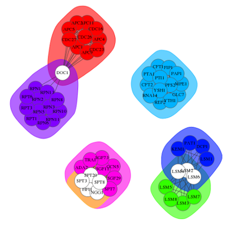
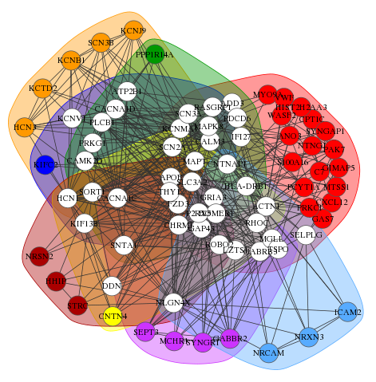
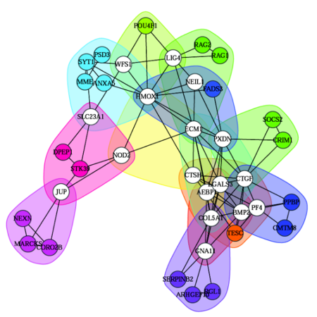
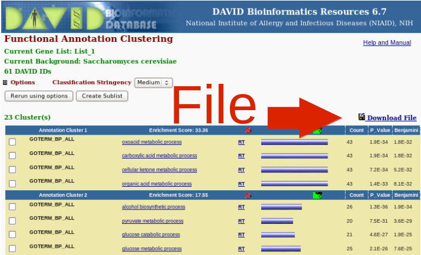
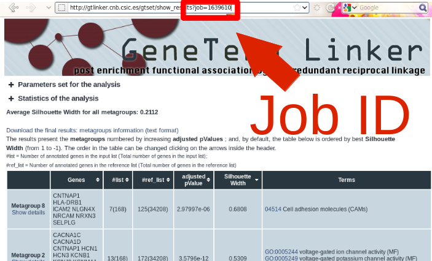
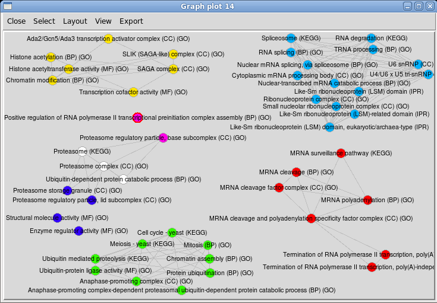
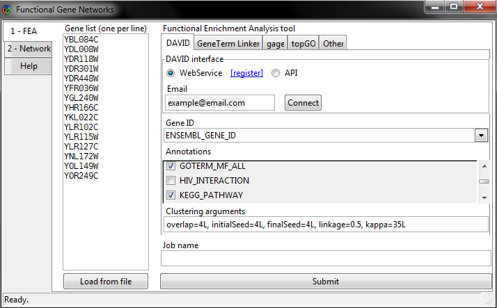

<!--
%\VignetteEngine{knitr::rmarkdown}
%\VignetteIndexEntry{FGNet}
-->

<style type="text/css">
table{ 
    max-width: 80% !important; 
    float:center;
}
img { 
    max-width: 80% !important; 
}
table img{ 
    max-width: 300px !important; 
   }
.subtitle{
    font-size:100%;
    font-style: italic; 
}
</style>

```{r pre,echo=FALSE,results='hide'}
library(knitr)
opts_chunk$set(warning=FALSE,message=FALSE,cache=TRUE)
```

# 1. Introduction to FGNet

FGNet allows to perform a Functional Enrichment Analysis (FEA) on a list of genes or expression set, and transform the results into networks. The resulting functional networks provide an overview of the biological functions of the genes/terms, and allows to easily see links between genes, overlap between clusters, finding key genes, etc.

FGNet takes as input a query list of genes selected by the user, and builds and displays networks of genes based in the existence of common functional terms that are enriched in certain subsets of genes of the list. By doing this, the tool allows to disclose groups/clusters of genes that have similar annotations and so they may have similar biological function in the cell. The discovery of molecular machines or functional modules within the cell (i.e. genes or proteins that work together to perform a biological process in the cells) is essential in modern molecular medicine and systems biology, because many times we do not know which are the gene partners playing in the same roles in a pathological state. FGNet is a tool that helps to create functional connections between different genes/proteins based on annotations. By grouping similar, redundant and homogeneous annotation content from the same or different biological resources into gene-term groups, the biological interpretation of large gene lists moves from a gene centric approach (where each gene is independent) to a functional-module centric approach (where the genes are interconnected). In this way, FGNet can provide a better representation of complex biological processes and reveal associations between genes.

## Biological functional analysis

After obtaining a list of genes or proteins from an experiment or omic studies (microarrays, RNAseq, mass spectrometry, etc), the next step is usually to perform a functional analysis of the genes to search for the biological functions or processes in which they are involved. In order to facilitate the analysis of large lists of genes, multiple functional enrichment tools have been developed. These tools search for the genes in biological databases (i.e. GO, Kegg, Interpro), and test whether any biological annotations are over-represented in the query gene list compared to what would be expected in the whole population. However, the raw output from a functional enrichment analysis often provides dozens or hundreds of terms, and it still requires a lot of time and attention to go through the whole list of genes and annotations. A way to simplify this task is grouping genes and terms which often appear together and create associated networks: the Functional Networks.

FGNet builds the functional networks, based on data from a previous functional enrichment analysis (FEA). The package provides the functions to perform the FEA through four specific tools:

* **GeneTerm Linker**, a post-enrichment tool, which focuses on clearing and sorting the results from a previous modular enrichment analysis. This is achieved by filtering general terms with low information content (i.e. *cellular process* or *protein binding*) and redundant annotations (i.e. *metabolic process* and *primary metabolic process*). The remaining gene-term sets are grouped into `metagroups` based on their shared genes and terms (using a reciprocal linkage approach) ([Fontanillo et al](#references)).

* **TopGO** ([Alexa et al](#references)), an enrichment analysis tool based on Gene Ontology (GO) that tests GO terms while accounting for the topology of the GO graph to eliminate local similarities and dependencies between GO terms. TopGO does not provide clusters, and therefore the functional network is built using only the gene-term sets. TopGO can be applied off-line.

* **GAGE** ([Luo et al](#references)), a gene set enrichment analysis (GSEA) tool. It searches for functional enrichment in gene sets (i.e. Reactome, GO) and allows including a signal value -like expression changes- to rank the genes and then to identify the enrichment in functional terms that are altered (i.e. changed in genes UP and DOWN) or altered consistently in one direction (UP or DOWN). GAGE also clusters the resulting enriched gene-term sets and can be applied off-line.

* **DAVID** with Functional Annotation Clustering (DAVID-FAC), which measures relationships among annotation terms based on their co-association with subsets of genes within the query gene list ([Huang et al](#references)). This type of clustering mostly results in groups of highly related terms, such as synonymous annotations from different annotation spaces (i.e. term "glycolysis" in KEGG and GO-BP), which also share most of their genes. This tool provides great coverage but does not avoid redundant terms and very general terms (like *signal transduction* or *regulation of transcription* that correspond to specific terms in Gene Ontology, GO). Unfortunately, DAVID analyses can no longer be run within R, but you can still perform the analysis on the website, and import the results into FGNet.

To build the network based on other *other tools*, the raw output should be saved into a text file which contains the enriched terms and their genes. (For more details see function `format_results()`).

## Functional network 

The **functional network**  is the representation of the results from a functional enrichment analysis.

In the **default**  network, all the nodes of the network are of the same type, i.e. genes OR terms, which are linked to each other if they are in the same gene-term set. In the plot, the genes/terms in the same  groups (metagroups or clusters) are surrounded by a common background color. 

In the **bipartite**  network, the nodes are of two types, allowing to link the genes or terms, with the clusters they belong to. This network, can be built as an *intersection network* , a simplified functional network where all the genes/terms that belong to only one metagroup are clustered into a single node. This simplified network contains only the nodes in several groups. 

In addition to the networks, FGNet also provides a few functions for further analysis. These functions allow to get a **distance matrix** , which represents the similarity between the groups based on the genes they share with each other (binary distance), and the distribution of **degree and betweenness**  within the network and subnetworks, in order to find the most important genes (hubs).

All these functionalities can be accessed directly through the appropriate functions or the graphical user interface (GUI). In addition, FGNet also allows to generate an  **HTML report**  with an overview of these plots and analyses for a specific gene list.

Examples of functional network for different analyses: 
    
|           |      | |
|:-----|:-----|:-----|
|  |  |  |

# 2. Installation

To install *FGNet* from *Bioconductor*, type in your R console:
```{r, eval=FALSE}
if (!requireNamespace("BiocManager", quietly=TRUE))
    install.packages("BiocManager")
BiocManager::install("FGNet")
```
```{r, echo=FALSE, message=FALSE}
library(FGNet)
```

To reduce system requirements, only the minimum packages are required to execute FGNet. 
However, there are several functionalities that require further packages. i.e. the Graphical User Interface (GUI) requires "RGtk2", the FEA analyses might require "gage", "topGO" or some annotation packages... etc.

To make sure all FGNet functionalities are available, install the following packages:
```{r, eval=FALSE}
BiocManager::install(c("RCurl",
    "gage", "topGO", 
    "GO.db", "reactome.db", "org.Sc.sgd.db"))

BiocManager::install(c("RGtk2"))
```


# 3. Creating a network

To generate a functional network with FGNet:
    
1.  Perform a Functional Enrichment Analysis (FEA) on a list of genes, proteins or expression set.
    
    |FEA tool         |Online?  |Input          |Annotations        |
    |:----------------|:---------|:--------------|:------------------|
    |Gene-Term Linker |Yes       |Gene list      |GO, Interpro       |
    |TopGO            |No        |Gene list      |GO                 |
    |GAGE (GSEA)      |No        |Expression set |Any gene set       |
    |DAVID            |Only web  |Gene list      |Many               |


2.  Create an [HTML report](#html-report) with multiple views of the networks and analyses.
3.  Personalize or analyze an [specific network](#individual-networks). 

These steps are integrated into the Graphical User Interface (GUI), which provides access to the main functionalities of FGNet.

## In R code...
The first step in the workflow is always is to perform a Functional Enrichment Analysis (FEA) on a list of genes or expression set. 

Once the FEA is ready, you can proceed to generate the HTML report or the individual network/analyses:


    
For help or more details on any functions or their arguments, just set a ? before its name.

```{r, eval=FALSE}
?FGNet_report
```

### Functional Enrichment Analysis (FEA)

Since the arguments required to perform the FEA depends on the tool, there are several FEA functions:

| FEA tool  | Function | Output group type |
|----------|---------|---------|
| TopGO | `fea_topGO()` | No grouping |
| Gene-Term Linker | `fea_gtLinker()` & `fea_gtLinker_getResults()` | Metagroups |
| GAGE | `fea_gage()` | Clusters |
| Other | `format_feaResults()` | |
| DAVID | `Website` | Clusters |

All the FEA functions and `FGNet_report()` save the results in the current working directory. 
```{r, eval=FALSE}
getwd()
```

Here is an example analyzing a gene list with the different tools:
```{r}
genesYeast <- c("ADA2", "APC1", "APC11", "APC2", "APC4", "APC5", "APC9", "CDC16", 
                "CDC23", "CDC26", "CDC27", "CFT1", "CFT2", "DCP1", "DOC1", "FIP1", 
                "GCN5", "GLC7", "HFI1", "KEM1", "LSM1", "LSM2", "LSM3", "LSM4", 
                "LSM5", "LSM6", "LSM7", "LSM8", "MPE1", "NGG1", "PAP1", "PAT1", 
                "PFS2", "PTA1", "PTI1", "REF2", "RNA14", "RPN1", "RPN10", "RPN11", 
                "RPN13", "RPN2", "RPN3", "RPN5", "RPN6", "RPN8", "RPT1", "RPT3", 
                "RPT6", "SGF11", "SGF29", "SGF73", "SPT20", "SPT3", "SPT7", "SPT8", 
                "TRA1", "YSH1", "YTH1")

library(org.Sc.sgd.db)
geneLabels <- unlist(as.list(org.Sc.sgdGENENAME))
genesYeast <- sort(geneLabels[which(geneLabels %in% genesYeast)])

# Optional: Gene expression (1=UP, -1=DW)
genesYeastExpr <- setNames(c(rep(1,28), rep(-1,30)),genesYeast) 

```
    
#### TopGO
    
Since TopGO uses local databases, it does not require internet connection. 

The results from topGO are provided as individual gene-term sets not grouped into clusters. FGNet treats each *gene-term set* as a single cluster.


```{r, eval=FALSE}
feaResults_topGO <- fea_topGO(genesYeast, geneIdType="GENENAME", organism="Sc") 
?fea_topGO
```

#### GAGE
    
As a GSEA approach, instead of performing the functional enrichment over a gene list, gage requires a raw expression set and the samples to compare:

```{r, eval=FALSE}
library(gage)
data(gse16873)

# Set gene labels? (they need to have unique identifiers)
# BiocManager::install("org.Hs.eg.db")
library(org.Hs.eg.db)
geneSymbols <- select(org.Hs.eg.db,columns="SYMBOL",keytype="ENTREZID", 
    keys=rownames(gse16873))

geneLabels <- geneSymbols$SYMBOL
names(geneLabels) <- geneSymbols$ENTREZID
head(geneLabels)

# GAGE:
feaResults_gage <- fea_gage(eset=gse16873, 
                         refSamples=grep('HN',colnames(gse16873)), 
                         compSamples=grep('DCIS',colnames(gse16873)), 
                         geneLabels=geneLabels, annotations="REACTOME",
                         geneIdType="ENTREZID", organism="Hs")
?fea_gage
```


#### Other tools
    
To import the results from a functional enrichment analysis performed with other tools, see:

```{r, eval=FALSE}
?format_results()
```

#### Web analysis

FGNet can also be applied to an analysis performed at DAVID and GeneTerm Linker web site:

*  DAVID: http://david.abcc.ncifcrf.gov (Functional Annotation Clustering Tool)
*  GeneTerm Linker: http://gtlinker.cnb.csic.es


To import these results into FGNet, use DAVID's `download file` or GeneTerm linker's `job ID`, and the functions `format_david()` or `fea_gtLinker_getResults()`:


|            |        |
|:-----|:-----|
| David | Gene-term Linker |

```{r, eval=FALSE}
feaResults_David <- format_david("http://david.abcc.ncifcrf.gov/data/download/90128.txt")
feaResults_gtLinker <- fea_gtLinker_getResults(jobID=3907019)
```

### HTML report
The HTML report function allows to create a comprehensive report including different views of the Functional Network, the cluster/metagroup legend, and some further statistics directly directly from a gene list. 

Here is the code to use `FGNet_report()` with each of the previous examples:
```{r, eval=FALSE}
FGNet_report(feaResults_topGO, geneExpr=genesYeastExpr)  
FGNet_report(feaResults_gage)
FGNet_report(feaResults_David, geneExpr=genesYeastExpr)
FGNet_report(feaResults_gtLinker, geneExpr=genesYeastExpr)
```

By default, the clusters included in these reports are filtered out to get cleaner results. The default values depend on the tool, and can be modified through FGNet_report arguments:
```{r, eval=FALSE}
data(FEA_tools)
FEA_tools[,4:6]
```

```{r, eval=FALSE}
FGNet_report(feaResults_gtLinker, filterThreshold=0.3)
```

```{r, eval=FALSE}
?FGNet_report
```


### Individual networks
After the FEA is ready, it is also possible to generate specific networks rather than the full report. Here is a simple example on how to use  `fea2incidMat()` to generate the incidence matrices that represent the networks and plot them.  There are more detailed examples on how to edit and explore the networks in sections [Editing and creating new networks](#editing-and-creating-new-networks) and [Filtering and selecting clusters](#filtering-and-selecting-clusters).

```{r, eval=FALSE}
#feaResults <- feaResults_gtLinker
feaResults <- feaResults_gage
incidMat <- fea2incidMat(feaResults)
incidMat$metagroupsMatrix[1:5, 1:5]
incidMat_terms <- fea2incidMat(feaResults, key="Terms")
incidMat_terms$metagroupsMatrix[5:10, 1:5]
```

These incidence matrices can be plotted and analyzed in different ways:

```{r, eval=FALSE}
functionalNetwork(incidMat, geneExpr=genesYeastExpr,
    plotTitleSub="Default gene view")
```

```{r, eval=FALSE}
getTerms(feaResults)[1]
```

```{r, eval=FALSE}
functionalNetwork(incidMat_terms, plotOutput="dynamic")
```




```{r, eval=FALSE}
functionalNetwork(incidMat_terms, plotType="bipartite",
    plotTitleSub="Terms in several metagroups")
```


# 4. Editing and creating new networks

In this section we will use the functional analysis of an Alzheimer dataset ([GSE4757](http://www.ncbi.nlm.nih.gov/geo/query/acc.cgi?acc=GSE4757)):
```{r, eval=FALSE}
jobID <- 1639610
feaAlzheimer <- fea_gtLinker_getResults(jobID=jobID, organism="Hs")
```

The variable `feaAlzheimer` contains the raw results from the functional analysis. The slot `metagroups` could also be `clusters` or missing depending on the FEA tool:
```{r, eval=FALSE}
names(feaAlzheimer)
```

```{r, results='hide', eval=FALSE}
head(feaAlzheimer$metagroups)
```

To see the terms in each cluster/metagroup use `getTerms()`:
```{r, eval=FALSE}
getTerms(feaAlzheimer)[3:4]
```

## Incidence matrices

The FEA results should be transformed into incidence matrices to create the network. These matrices are the internal representation of the network: they contain which genes are in each metagroup or cluster and in each gene-term set. Therefore, it is in this step where the main shape of the network is determined. 

The function to create the incidence matrices is `fea2incidMat()`. It allows to filter out clusters, decide whether the networks should be gene-based or term-based, establish the groups to link the genes/terms, etc...

We will start the example creating a simple gene-based network:

```{r, eval=FALSE}
incidMat <- fea2incidMat(feaAlzheimer)
```

```{r, eval=FALSE}
head(incidMat$metagroupsMatrix)
incidMat$gtSetsMatrix[1:5, 14:18]
```

To filter or select with metagroups to show, use the arguments `filterAttribute`, `filterOperator` and `filterThreshold`. `filterAttribute` should be a column from the `feaAlzheimer$clusters` or `feaAlzheimer$metagroups` data frames. The recommended filters for each tool can be seen in the object `FEA_tools`, which contains the default filters when generating the HTML report:

```{r, eval=FALSE}
data(FEA_tools)
FEA_tools[,4:6]
```

```{r, eval=FALSE}
incidMatFiltered <- fea2incidMat(feaAlzheimer, 
    filterAttribute="Silhouette Width", filterOperator="<", filterThreshold=0.2)
```

To see which metagroups/clusters have been filtered out and will not be shown in the networks:

```{r, eval=FALSE}
incidMatFiltered$filteredOut
```

For more on selecting and filtering groups see section '[filtering](#filtering-and-selecting-clusters)'.
To build the [networks based on terms](#terms-networks), use the argument `key="Terms"`.

## Functional network

The function `functionalNetwork()` generates and plots the networks.
In case there is available expression data, it can be used for representation in this step:

```{r, eval=FALSE}
# (Fake expression data)
genesAlz <- rownames(incidMat$metagroupsMatrix)
genesAlzExpr <- setNames(c(rep(1,50), rep(-1,27)), genesAlz) 
```

The `default` plot will plot all the genes/terms in the network, and will return the networks as igraph objects and matrices in an invisible list. The argument `keepColors` determine whether the colors should be consistent, taking into account the filtered groups, or restarted:
```{r, eval=FALSE}
fNw <- functionalNetwork(incidMatFiltered, geneExpr=genesAlzExpr, keepColors=FALSE, vLabelCex=0.5)
```

By setting the parameter `plotOutput="dynamic"` instead of an static plot, it will create an interactive one. By setting  `plotOutput="none"`, it is possible to produce only the network without plotting.
```{r, eval=FALSE}
functionalNetwork(incidMatFiltered, geneExpr=genesAlzExpr, plotOutput="dynamic") 
fNw <- functionalNetwork(incidMatFiltered, plotOutput="none") 
```

Since the returned networks are `iGraph` objects, they can be used or analyzed as such:
```{r, eval=FALSE}
names(fNw)
names(fNw$iGraph)
library(igraph)
clNw <- fNw$iGraph$commonClusters
clNw
```

```{r, eval=FALSE}
vcount(clNw)
ecount(clNw)
sort(betweenness(clNw), decreasing=TRUE)[1:10]
igraph.to.graphNEL(clNw)
```

In dynamic plots (`tkplot`) it is not possible to draw the metagroup background. However, you can save the layout of a dynamic network, and plot it as static using the argument `vLayout`:

```{r, eval=FALSE}
functionalNetwork(incidMatFiltered, plotOutput="dynamic") 
# Modify the layout...
saveLayout <- tkplot.getcoords(1)   # tkp.id (ID of the tkplot window)
functionalNetwork(incidMatFiltered, vLayout=saveLayout)
```

## Bipartite and intersection network
The default `bipartite` version of the functional network plots the *intersection network*: a simplified functional network, containing only the nodes in several metagroups and the metagroups they belong to. In this network, metagroup nodes (the coloured nodes) can be seen as a cluster of all the genes/proteins that belong only to that metagroup:

```{r, eval=FALSE}
mgKeyTerm <- keywordsTerm(getTerms(feaAlzheimer), 
    nChar=100)[-c(as.numeric(incidMatFiltered$filteredOut))]
functionalNetwork(incidMatFiltered, plotType="bipartite", legendText=mgKeyTerm)
```

To plot a full bipartite network including all the nodes, just set `keepAllNodes=TRUE`:
```{r, eval=FALSE}
functionalNetwork(incidMatFiltered, geneExpr=genesAlzExpr, plotType="bipartite", keepAllNodes=TRUE, 
    plotTitleSub="Bipartite network will all nodes", legendText=mgKeyTerm, vLabelCex=0.5)
```

## Terms networks

In the same way we have built networks to explore the relationship between genes, the same approach can be used to explore the relationship between the biological terms in the enrichment analysis. i.e. to see which biological terms are usually associated, or locate which terms are in several groups. 
To do so, build the incidence matrices based on terms instead of genes using the argument `key="Terms"`.

```{r, eval=FALSE}
incidMatTerms <- fea2incidMat(feaAlzheimer, key="Terms")
```

```{r, eval=FALSE}
functionalNetwork(incidMatTerms, plotType="bipartite", 
    plotTitle="Terms in several metagroups")
```

By default, the functional network is built establishing links between nodes (genes or terms) in the same gene-term sets. Depending on the tool, this network might have few or no edges:

```{r, eval=FALSE}
functionalNetwork(incidMatTerms,  weighted=TRUE, plotOutput="dynamic")
```

To plot a network with links between all the terms in the same cluster or metagroups, use `fea2incidMat()` with the `$cluster` or `$metagroup` slots from the FEA, in order to consider the whole cluster/metagroup as a gene-term set:

```{r, eval=FALSE}
incidMatTerms <- fea2incidMat(feaAlzheimer$metagroups, clusterColumn="Metagroup", 
    key="Terms",
    filterAttribute="Silhouette.Width", filterThreshold=0.2)
functionalNetwork(incidMatTerms, legendText=FALSE, plotOutput="dynamic")
```

```{r, eval=FALSE}
functionalNetwork(incidMatTerms, legendText=FALSE)
```

Since GeneTerm Linker filters out generic and redundant terms from the final metagroups, by default these terms are not plotted. To include them in the graph, set the argument `removeFiltered=FALSE` (only available for GeneTerm Linker).

```{r, fig.height=5, fig.width=10, eval=FALSE}
incidMatTerms <- fea2incidMat(feaAlzheimer, key="Terms", removeFilteredGtl=FALSE)
par(mfrow=c(1,2))
functionalNetwork(incidMatTerms, vLabelCex=0.2,
    plotTitle="Including filtered terms", legendText=FALSE)
functionalNetwork(incidMatTerms, plotType="bipartite", vLabelCex=0.4,
    plotTitle="Including filtered terms")
```

For more information on the filtered terms see ([Fontanillo et al](#references)) or http://gtlinker.cnb.csic.es/gtset/help .

## Genes - Terms networks

To build a genes-terms network, we can use the bipartite plot with the appropriate formatting of the input matrices.

For many FEA tools it will be enough with applying the `fea2incidMat()` directly to the `$geneTermSets` matrix selecting the gene-term sets we want to plot.
i.e. gene-term sets in a specific cluster, filter generic terms (terms annotated to more than X genes), etc...

Note that this approach might not be appropriate for GeneTerm Linker, since it groups several terms into each gene-term set.

```{r, eval=FALSE}
txtFile <- paste(file.path(system.file('examples', package='FGNet')), "DAVID_Yeast_raw.txt", sep=.Platform$file.sep)
feaResults_David <- format_david(txtFile, jobName="David_example", geneLabels=genesYeast)
```

```{r, eval=FALSE}
# Sorry, this function is no longer supported. Use  another fea_ function, or DAVID through the website.
# feaResults_David <- fea_david(names(genesYeast), email="...", geneLabels=genesYeast)
```

```{r, eval=FALSE}
gtSets <- feaResults_David$geneTermSets
gtSets <- gtSets[gtSets$Cluster %in% c(9),] 
gtSets <- gtSets[gtSets$Pop.Hits<500,]
```

Then, create a terms-genes incidence matrix with `fea2incidMat()`, and plot the network...

```{r, message=FALSE, eval=FALSE}
termsGenes <- t(fea2incidMat(gtSets, clusterColumn="Terms")$clustersMatrix)
library(R.utils)
rownames(termsGenes) <- sapply(strsplit(rownames(termsGenes), ":"), 
    function(x) capitalize(x[length(x)]))
termsGenes[1:5,1:5]
```

Network with genes colored based on their expression and terms on alphabetical order:
```{r, eval=FALSE}
functionalNetwork(t(termsGenes), plotType="bipartite", keepAllNodes=TRUE,
    legendPrefix="", plotTitle="Genes - Terms network", plotTitleSub="",
    geneExpr=genesYeastExpr, plotExpression="Fill")
```  

Network with genes colored by alphabetical order (from red to pink), terms white:
```{r, eval=FALSE}
functionalNetwork(termsGenes, plotType="bipartite", keepAllNodes=TRUE,
    legendPrefix="", plotTitle="Genes - Terms network", plotTitleSub="")
```


# 5. Filtering and selecting clusters

As an example of analysis of a network with very overlapping clusters, we will use the yeast gene list analyzed with DAVID:

```{r, eval=FALSE}
incidMat <- fea2incidMat(feaResults_David)
functionalNetwork(incidMat) 
```

```{r, eval=FALSE}
incidMatTerms <- fea2incidMat(feaResults_David, key="Terms")
```

```{r, eval=FALSE}
functionalNetwork(incidMatTerms$clustersMatrix, plotOutput="dynamic",
  weighted=TRUE, eColor="grey")
```

```{r, eval=FALSE}
functionalNetwork(incidMatTerms$clustersMatrix, plotType="bipartite", 
 plotTitle="Terms in several clusters")
```

## Filtering based on a *cluster* property

The clusters to plot can be selected/filtered based on any property that is available in the clusters matrix:

```{r, eval=FALSE}
colnames(feaResults_David$clusters)
```

i.e. Selecting the clusters with highest Enrichment Score or least genes (setting `eColor=NA`, plots the networks without edges):

```{r, fig.height=5, fig.width=10, eval=FALSE}
par(mfrow=c(1,2))

# Highest enrichment score
filterProp <- as.numeric(as.character(feaResults_David$clusters$ClusterEnrichmentScore))
quantile(filterProp, c(0.10, 0.25, 0.5, 0.75, 0.9))
incidMatFiltered <- fea2incidMat(feaResults_David, 
    filterAttribute="ClusterEnrichmentScore",
    filterOperator="<", filterThreshold=7.65)
functionalNetwork(incidMatFiltered, eColor=NA,
    plotTitle="Highest enrichment score")

# Lowest genes
quantile(as.numeric(as.character(feaResults_David$clusters$nGenes)),
    c(0.10, 0.25, 0.5, 0.75, 0.9))
incidMatFiltered <- fea2incidMat(feaResults_David, 
 filterAttribute="nGenes", filterOperator=">", filterThreshold=20)
functionalNetwork(incidMatFiltered, plotTitle="Smallest clusters")
```
 
To use any property that is not available in the `$clusters` data frame, just add it as column to the dataframe.
 
## Selecting clusters with specific keywords

```{r, eval=FALSE}
keywordsTerm(getTerms(feaResults_David), nChar=100)

keywords <- c("hydrolase") 
selectedClusters <- sapply(getTerms(feaResults_David), 
    function(x) 
    any(grep(paste("(", paste(keywords, collapse="|") ,")",sep=""), tolower(x))))
```
```{r, eval=FALSE}
getTerms(feaResults_David)[selectedClusters]
```
```{r, eval=FALSE}
tmpFea <- feaResults_David
tmpFea$clusters <- cbind(tmpFea$clusters, keywords=selectedClusters)
incidMatSelection <- fea2incidMat(tmpFea, 
 filterAttribute="keywords", filterOperator="!=",filterThreshold="TRUE")
functionalNetwork(incidMatSelection, plotType="bipartite")
```

## Selecting specific clusters

`clustersDistance()` allows to explore the overlap between clusters:
```{r, eval=FALSE}
distMat <- clustersDistance(incidMat)
```

```{r, echo=FALSE, results='hide', eval=FALSE}
dev.off()
```

Clusters 4, 1 and 2 seem to be completely overlapping (distance 0). While cluster 11 does not have any intersection with clusters 8 and 9. Let's see:
```{r, eval=FALSE}
selectedClusters <- rep(FALSE, nrow(feaResults_David$clusters))
selectedClusters[c(8,9,11)] <- TRUE

tmpFea <- feaResults_David
tmpFea$clusters <- cbind(tmpFea$clusters, select=selectedClusters)
incidMatSelection <- fea2incidMat(tmpFea, 
  filterAttribute="select", filterOperator="!=",filterThreshold="TRUE")
functionalNetwork(incidMatSelection, eColor=NA)
```

## Filtering based on a *gene-term set* property

In some ocasions, it might also be useful to filter out gene-term sets within a cluster. i.e. The terms in the top of the GO ontologies are annotated to many genes and make most clusters overalp. 

To filter out terms, (1) filter or select the terms in the the `feaReults$geneTermSets` data frame, (2) save it as text file, and (3) import it with `readGeneTermSets()`

In this case, we will use DAVID's example, and keep the terms thar are annotated to less than 100 genes in yeast:
```{r, eval=FALSE}
# No longer supported
# Same analysis, setting overlap to 6:
# feaResults_David_ov6 <- fea_david(names(genesYeast), geneLabels=genesYeast, email="example@email.com",
#     argsWS=c(overlap=6, initialSeed=3, finalSeed=3, linkage=0.5, kappa=50))
```
```{r, echo=FALSE}
txtFile <- paste(file.path(system.file('examples', package='FGNet')), "DAVID_Yeast_overl6_raw.txt", sep=.Platform$file.sep)
feaResults_David_ov6 <- format_david(txtFile, jobName="David_example", geneLabels=genesYeast)
```

```{r, eval=FALSE}
# Filter/select
sum(feaResults_David_ov6$geneTermSets$Pop.Hits < 100)
gtSets <- feaResults_David_ov6$geneTermSets[feaResults_David_ov6$geneTermSets$Pop.Hits < 100,]
# Save 
write.table(gtSets, file="david_filteredGtsets.txt", sep="\t", col.names = TRUE, quote=FALSE)
# Load with "readGeneTermSets"
feaResults_filteredGtsets <- readGeneTermSets("david_filteredGtsets.txt", tool="DAVID")
# ...
functionalNetwork(fea2incidMat(feaResults_filteredGtsets), vLabelCex=0.5)  
```

To explore the distribution of genes-terms in a specific organism: 
```{r, eval=FALSE}
# Yeast
library(org.Sc.sgd.db)
goGenesCountSc <- table(sapply(as.list(org.Sc.sgdGO2ORF), length))
barplot(goGenesCountSc, main="Number of genes annotated to GO term (Sc) ", 
    xlab="Number of genes", ylab="Number of GO terms")

# Human
library(org.Hs.eg.db)
goGenesCountHs <- table(sapply(as.list(org.Hs.egGO2EG), length))
barplot(goGenesCountHs, main="Number of genes annotated to GO term (Human)", 
    xlab="Number of genes", ylab="Number of GO terms")
```


# 6. Other auxiliary functions

## analyzeNetwork() 
`analyzeNetwork()` can be used to explore the structure of the network. It also returns statistics about the nodes betweenness within each cluster, etc...

The example with GeneTerm Linker (Alzheimer):
```{r, eval=FALSE}
incidMatFiltered <- fea2incidMat(feaAlzheimer, 
    filterAttribute="Silhouette Width", filterOperator="<", filterThreshold=0.2)
stats <- analyzeNetwork(incidMatFiltered)
```
```{r, eval=FALSE}
names(stats)
stats$transitivity
```

`$degree` and `$betweenness` are the values used for the plots. They contain the values for each of the nodes in the global network (commonClusters) and within each cluster/metagroup (subsets of commonGtSets network). The degree is given as percentage, normalized based on the total number of nodes of the network. i.e. a value of 90 in a network of 10 nodes, would mean the actual degree of the node is 9: it is connected to 9 nodes (90% of 10)).

The betweenness of each node in each cluster as matrix:
```{r, eval=FALSE}
head(stats$betweennessMatrix)
```

**Inter-modular hubs:** Nodes with betweenness within the top 75% in the global network
```{r, eval=FALSE}
stats$hubsList$Global
```

**Intra-modular hubs:** Nodes with betweenness within the top 75% in each cluster sub-network
```{r, eval=FALSE}
stats$hubsList$"9"
``` 

DAVID's example: 
```{r, eval=FALSE}
incidMat_metab <- fea2incidMat(feaResults_David)
analyzeNetwork(incidMat_metab)
```

Note the structure of the network varies not only depending on the dataset, but also on the tool. Since tools like DAVID link all the nodes/terms within each cluster, their internal normalized degree is always 100%.


## plotGoAncestors()

`plotGoAncestors()` also allow to explore the significant gene term sets:
```{r, eval=FALSE}
goIds <- getTerms(feaResults_David, returnValue="GO")[[7]]
 plotGoAncestors(goIds, ontology="MF", nCharTerm=40, labelCex=0.8)
```


# 7. Acknowledgments

This work was supported by Instituto de Salud Carlos III [Research Projects PS09/00843 and PI12/00624] and by a grant from the Junta de Castilla y Leon and the European Social Fund to S.A and C.D.


# 8. References 

* Huang DW, Sherman BT, Lempicki RA. *Systematic and integrative analysis of large gene lists using DAVID Bioinformatics Resources.* Nature Protoc. 2009;4(1):44-57.

* Huang DW, Sherman BT, Lempicki RA. *Bioinformatics enrichment tools: paths toward the comprehensive functional analysis of large gene lists.* Nucleic Acids Res. 2009;37(1):1-13.

* Fontanillo C, Nogales-Cadenas R, Pascual-Montano A, De Las Rivas J (2011) *Functional Analysis beyond Enrichment: Non-Redundant Reciprocal Linkage of Genes and Biological Terms.* PLoS ONE 6(9): e24289. doi: 10.1371/journal.pone.0024289 

* Alexa A, and Rahnenfuhrer J (2010) *topGO: Enrichment analysis for Gene Ontology.* R package version 2.16.0. URL: http://www.bioconductor.org/packages/release/bioc/html/topGO.html

* Luo W, Friedman MS, Shedden K, Hankenson KD, Woolf PJ (2009) *GAGE: generally applicable gene set enrichment for pathway analysis.* BMC Bioinformatics. 10:161. URL: http://www.bioconductor.org/packages/release/bioc/html/gage.html


# Deprecated functionalities:

## Graphical User Interface (GUI)

The Graphical User Interface (GUI) provides access to most FGNet functionalities in Windows and Linux.

Note: Since April 2022 the `RGtk2` package that is used for the interface is not available. It will be deprecated/updated within the next FGNet versions.

To launch the GUI, type in the R console:

```{r, eval=FALSE}
library(FGNet)
FGNet_GUI()
```


    
In case you already have a gene list or gene expression from a previous analysis, it is possible to load it directly into the GUI genes field by passing it as argument:

```{r, eval=FALSE}
geneExpr <- c("YBL084C", "YDL008W", "YDR118W", "YDR301W", "YDR448W", 
              "YFR036W", "YGL240W", "YHR166C", "YKL022C", "YLR102C", "YLR115W", 
              "YLR127C", "YNL172W", "YOL149W", "YOR249C")
geneExpr <- setNames(c(rep(1,10),rep(-1,5)), geneExpr)

FGNet_GUI(geneExpr)
```


**Gene-Term Linker**
    
Gene-Term Linker is no longer available.
    
Since the analysis with Gene-Term Linker usually takes several minutes to be ready, the workflow is divided in two steps: (1) sending the analysis request, and (2) retrieving the results:

```{r, eval=FALSE}
jobID <- fea_gtLinker(geneList=genesYeast, organism="Sc")
?fea_gtLinker
```

once the analysis is ready...

```{r, eval=FALSE}
jobID <- 3907019
feaResults_gtLinker <- fea_gtLinker_getResults(jobID=jobID, organism="Sc")
```

